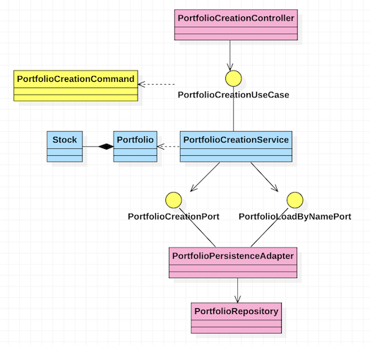
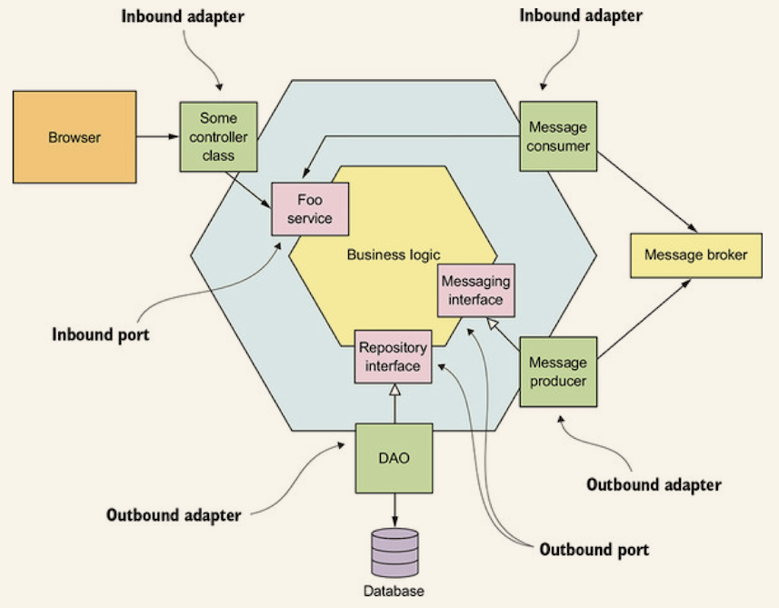

# Hexagonal Architecture

This toy project shows how to implement a service using Spring Boot, Kotlin, and the Hexagonal Architecture. The 
represented domain model is the management of a **stocks' portfolio**.

The project implements the hexagonal architecture using a structure similar to the following:

The above class diagram models the *creation of a new portfolio*.

Keep in mind that a hexagonal architecture's objective is to avoid dependency from the domain's 
classes to the types that are not directly related to the modeling of the domain. This kind of
architecture mainly uses the SOLID concept of *Inversion of Dependency*.

The types colored in light-blue represents the domain, that is the core of the application. These 
components have no dependency with any other concrete part of the application. This part is the 
**center of the hexagon**.

The type colored in yellow are the input and output ports. Through these interfaces, the core of
the application consumes and offers external services. The `UseCase`s interfaces represent input 
ports. The `Port`s interfaces represent the output ports. These components are the **edges of the 
hexagon**. 

Last but not least, there are the external adapters, colored in pink. The adapters are the point of
contact of the application with any external system. For example, the `Controller`s are the input 
adapter receiving requests and commands from the outside. Whereas, the `PersistenceAdpater`s adapt
the communication with persistence systems.

Similarly, we can have adapters from and to messaging systems, such as a Kafka broker.

## User Stories

The implemented user stories are the following:
- A user should create a new portfolio.
- A user should buy stocks for an existing portfolio.
- A user should sell stocks that it owns.
- The system should receive the price of a stock via Kafka message
- The system should produce an event if the value of an owned stock falls down below a threshold

## Testing

Every concrete type in the project has at least an associated unit test. The test of the components
that integrate with Kafka use the [`kafkaesque`](https://github.com/rcardin/kafkaesque) testing 
library.

## References

* _Microservices Patterns With examples in Java_, Chris Richardson, 2018, Manning Publications
* _Get Your Hands Dirty on Clean Architecture_, Tom Hombergs, 2019, Packt Publishing